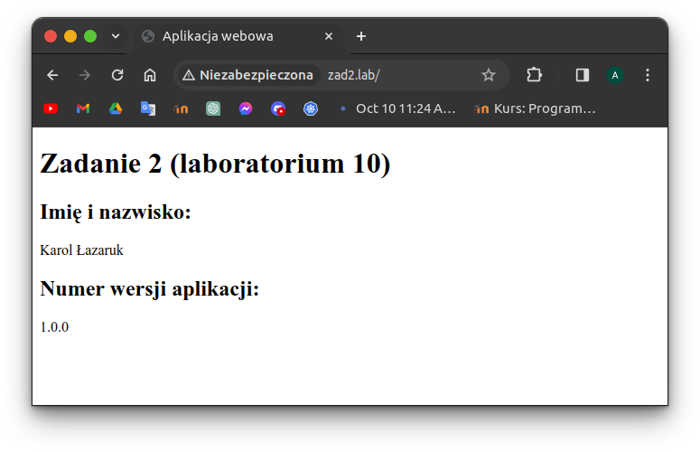
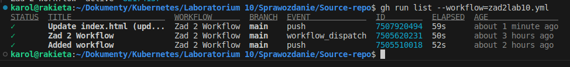

# Krok 1
Zadnie rozpocząłem od instalacji i niezbędnej konfiguracji środowiska GitHub CLI. W pierwszej kolejności utworzyłem repozytoria `Source-repo` oraz `Config-repo`, przy użyciu następujących poleceń:

```
gh repo create Source-repo --public --description "Source repository"
gh repo create Config-repo --public --description "Config repository"
```

Wynik działania poleceń:  


Repozytoria dostępne są pod następującymi adresami:  
+ [Source-repo](https://github.com/kkmp/Source-repo)  
+ [Config-repo](https://github.com/kkmp/Config-repo)

Zadanie wymagało również utworzenia dwóch repozytoriów DockerHub, które są dostępne pod poniższymi linkami:
+ [Obraz zad2](https://hub.docker.com/repository/docker/kkmp13/zad2/general)
+ [Obraz zad2gitops](https://hub.docker.com/repository/docker/kkmp13/zad2gitops/general)

W dalszej części pobrałem lokalnie utworzone repozytoria, przy użyciu komend:
```
gh repo clone Source-repo
gh repo clone Config-repo
```

Wynik działania poleceń:  


## 1A.
Zgodnie z treścią zadania, przygotowałem następujące pliki źródłowe:
+ Plik [index.html](https://github.com/kkmp/Source-repo/blob/main/app/index.html) w katalogu `app`, stanowiący plik źródłowy statycznej strony internetowej, który zawiera kod HTML, pozwalajacy na wyświetlenie imienia, nazwiska oraz numeru wersji aplikacji.
+ Plik [Dockerfile](https://github.com/kkmp/Source-repo/blob/main/Dockerfile), pozwalający na zbudowanie obrazu Dockera na podstawie najnowszej wersji obrazu `nginx`. Obraz zostanie zbudowany na podstawie skopiowanego pliku `index.html` do standardowego katalogu z plikami aplikacji serwera nginx. Aplikacja będzie działać na porcie 80. Dodatkowo wywołuję komendę pozwalającą na uruchomienie serwera w trybie demona, aby utrzymać kontener w ciągłym trybie pracy.

Tak przygotowane pliki umieszczam w repozytorium `Source-repo`, przy użyciu poleceń:

```
git add .
git commit -m "Initial commit"
git push
```

Wynik działania poleceń:  


## 1B.
Zgodnie z treścią zadania, przygotowałem następujące pliki manifestów yaml:
+ Plik [deployment.yaml](https://github.com/kkmp/Config-repo/blob/main/deployment.yaml), stanowiący wdrożenie aplikacji typu RollingUpdate w postaci 4 replik. Zdefiniowałem maksymalną liczbę replik w trakcie aktualizacji (5 replik) oraz minimalną liczbę działających replik (2 repliki). Kontenery wdrożenia będą wykorzystywały obraz Dockera, który zostanie zbudowany w następnych krokach. Wskazałem obraz przypisany do osobistego konta DockerHub, pod nazwą `zad2`, wstępnie w wersji 1.0.0 (pełna nazwa obrazu to `kkmp13/zad2:1.0.0`). Kontenery będą nasłuchiwały na porcie 80.
+ Plik [service.yaml](https://github.com/kkmp/Config-repo/blob/main/service.yaml), zawierający definicję serwisu typu NodePort, który będzie dostępny na porcie 80 oraz pozwoli kierować ruch do podów zdefiniowanego wcześniej deploymentu, operujacych na porcie 80.
+ Plik [ingress.yaml](https://github.com/kkmp/Config-repo/blob/main/ingress.yaml), definiujący usługę dostępu zewnętrznego typu Ingress, która będzie obsługiwała ruch dla hosta o nazwie `zad2.lab`. Zdefiniowałem regułę, która umożliwi kierowanie ruchu do uprzednio opisanego serwisu na port 80. Jako typ ścieżki wykorzystałem prefiks dla wszystkich żądań w domenie.

Tak przygotowane pliki umieściłem w repozytorium `Config-repo`, przy użyciu poleceń:
```
git add .
git commit -m "Initial commit"
git push
```

Wynik działania poleceń:  


# Krok 2
Utworzyłem plik `.github/workflows/zad2lab10.yml` przy użyciu komend:

```
mkdir -p .github/workflows
touch .github/workflows/zad2lab10.yml
```

## 2A.
Workflow zdefiniowany w pliku [zad2lab10.yml](https://github.com/kkmp/Source-repo/blob/main/.github/workflows/zad2lab10.yml) jest wyzwalany przy każdej operacji `push` oraz `pull request` na gałęzi `main`. Umieściłem również `workflow_dispatch`, aby umożliwić ręczne uruchamianie ciągu zadań. Workflow składa się z wymaganych w treści zadania jobów `dockerCI` oraz `kubernetesCI`, a także dodatkowego jobu `read-version`. Wszystkie trzy zadania wykorzystują najnowszą wersję systemu Ubuntu.

## 2B.
Job `read-version` jest odpowiedzialny za odczytanie wersji aplikacji i zapisanie jej do zmiennej `CURRENT_VERSION`. Dokonałem tego w dwóch krokach. Pierwszym z nich jest skojarzenie workflow z `Source-repo`. Drugi dotyczy odczytania wersji aplikacji z pliku `index.html` przy użyciu komendy `sed`, a następnie zapisania jej do zmiennej `CURRENT_VERSION`, tak aby można ją było odczytać w pozostałych jobach (`outputs`).  
Job `dockerCI` jest zadaniem uruchamianym po zakończeniu jobu `read-version`. Wykonuje on 5 kroków - skojarzenie workflow z repo `Source-repo`, instalację Quemu, instalację Buildx, zalogowanie się na koncie DockerHub oraz zbudowanie obrazu dla wybranych architektur sprzętowych (amd64 i arm64). Obraz jest budowany i przesyłany na osobiste konto DockerHub z tagiem, który stanowi numer wersji aplikacji zapisanej w zmiennej `CURRENT_VERSION` (odczytany w poprzednim jobie). Login oraz token, niezbędne do zalogowania do DockerHub, przechowuję w sekretnych zmiennych `DOCKERHUB_USERNAME` oraz `DOCKERHUB_TOKEN`, które dodałem do repozytorium `Source-repo` przy pomocy następujących poleceń:

```
gh secret set DOCKERHUB_USERNAME
gh secret set DOCKERHUB_TOKEN
```

Wynik działania poleceń:  


Job `kubernetesCI` jest zadaniem uruchamianym po zakończeniu jobów `read-version` oraz `dockerCI`. Wykonuje on 5 kroków - skojarzenie workflow z repo `Config-repo`, sprawdzenie czy wersja obrazu Docker w pliku `deployment.yaml` wymaga zmiany, opcjonalne wykonanie operacji commit lub wyświetlenie informacji o braku wykonania akcji. W celu uzyskania dostępu do "zewnętrznego" repozytorium, należało dodać token jako kolejną zmienną sekretną `ACTIONS_TOKEN`, zgodnie z poniższym poleceniem:

```
gh secret set ACTIONS_TOKEN
```

Wynik działania polecenia:


Dodane sekretne zmienne do repozytorium `Source-repo`:  


Do sprawdzenia, czy wersja obrazu Docker w pliku `deployment.yaml` wymaga zmiany, wykorzystuję program `grep`. Jeśli wersja się nie zmieniła (a co za tym idzie, nie ma konieczności jej podmiany w tagu obrazu Docker), do zmiennej `CHANGED` zapisuję wartość `false`. W przeciwnym wypadku jest to wartość `true`. Step o nazwie `Commit` zostaje wywołany tylko jeśli wartość zmiennej `CHANGED` jest ustawiona na `true`. Wówczas zostają skonfigurowane dane użytkownika wykonującego commit, przy użyciu instrukcji `sed` podmieniona zostaje wersja zbudowanego obrazu, a następnie wykonywany jest commit z operacją push. Jeśli zmienna `CHANGED` jest ustawiona na `false`, wówczas zostaje wyświetlona stosowna informacja.

Tak przygotowany plik `zad2lab10.yml` dołączyłem do repozytorium `Source-repo`, przy użyciu poleceń:

```
git add .
git commit -m "Added workflow"
git push
```

Wynik działania poleceń:


Aby sprawdzić, czy utworzony plik `zad2lab10.yml` może zostać zastosowany jako workflow, wydałem polecenie:

```
gh workflow list
```

Workflow został automatycznie aktywowany po wykonaniu commit, bez konieczności użycia polecenia:
```
gh workflow enable
```

Narzędzie GitHub CLI umożliwia wyświetlanie szczegółów dotyczących uruchamianych workflow - m.in. liczbę uruchomień, status wykonania, a także sam plik yml. Można tego dokonać poleceniami:

```
workflow view 82174137
gh workflow view 82174137
```

Możliwe jest również ręczne uruchomienie workflow (`workflow_dispatch`) przy użyciu polecenia, co również uczyniłem:

```
gh workflow run 82174137
```

Wynik działania poleceń:


# Krok 3
## 3A.
Tę część zadania rozpocząłem od przygotowania pliku `Dockerfile`, który korzysta z obrazu alpine w najnowszej wersji, a także pozwala zaktualizować pakiety systemowe oraz zainstalować programy `git`, `curl` oraz `kubectl`. W celu zbudowania i wypchnięcia obrazu `zad2gitops` do repozytorium, wykorzystałem polecenia:

```
docker build -t kkmp13/zad2gitops .
docker push kkmp13/zad2gitops:latest
```

## 3B.
W dalszej części utworzyłem dodatkowy plik `pv.yaml`, zawierający definicję obiektu typu PersistentVolume o wielkości 1 Gi z typem dostępu ReadWriteOnce. W związku z tym utworzyłem również obiekt z żądaniem utworzenia zasobu PersistentVolumeClaim o analogicznych parametrach (plik `pvc.yaml`).  
Kolejnym krokiem było utworzenie pliku `operator.yaml` definiującego obiekt CronJob. Obiekt korzysta ze skonfigurowanego zasobu pvc oraz zbudowanego obrazu `zad2gitops`, aby uruchamiać co dwie minuty polecenia umożliwiające usunięcie starej wersji repozytorium, ponowne jego sklonowanie, odnalezienie pobranych plików yaml oraz ich zastosowanie.

Aby po raz pierwszy uruchomić zdefiniowane manifesty plików yaml oraz nadać uprawnienia operatorowi do późniejszej aktualizacji utworzonych obiektów, wydałem następujący zestaw poleceń:

```
kubectl create sa gitops
kubectl create clusterrolebinding gitops-admin \
--clusterrole=cluster-admin --serviceaccount default:gitops

kubectl apply -f deployment.yaml
kubectl apply -f service.yaml
kubectl apply -f ingress.yaml

kubectl apply -f pv.yaml
kubectl apply -f pvc.yaml
kubectl apply -f operator.yaml
```

# Krok 4
## 4A.
W celu sprawdzenia poprawności działania po pierwszym uruchomieniu, sprawdziłem czy poszczególne obiekty zostały poprawnie stworzone i uruchomione (weryfikacja ta została pominięta w sprawozdaniu).  
Aby sprawdzić czy opracowana aplikacja działa prawidłowo, uruchomiłem tunel przy użyciu polecenia:

```
minikube tunnel
```

W dalszej części edytowałem plik `/etc/hosts`, tak aby aplikacja była dostępna pod adresem http://zad2.lab. Do pliku dodałem następujący wpis:

```
127.0.0.1	zad2.lab
```

Zawartość pliku `/etc/hosts` po zmianie:  


Zgodnie z oczekiwaniami, możliwe jest wyświetlenie zawartości strony poprzez wykorzystanie komendy:

```
curl -H "Host: zad2.lab" http://localhost 
```

Wynik działania polecenia:  


Analogicznie, po wpisaniu adresu http://zad2.lab w pasek przeglądarki, możliwe jest wyświetlenie opracowanej strony internetowej:  


## 4B.
W celu potwierdzenia poprawności działania opracowanego łańcucha automatycznego wdrażania aplikacji, zgodnie z treścią zadnia, zmieniłem wersję aplikacji z 1.0.0. na 1.0.1 w pliku `index.html`, a następnie zatwierdziłem zmiany i wypchnąłem je do repozytorium. Operacja `push` automatycznie uruchomiła workflow, co może zostać zaobserwowane poniżej:  


Pomyślne wykonanie workflow może zostać również zaobserwowane z poziomu strony repozytorium, w zakładce Actions:  


Na stronie internetowej repozytorium DockerHub możemy zaobserwować, że pomyślnie został wypchnięty najnowszy obraz w pożądanej wersji 1.0.1:  


Weryfikacja ostatnich zmian w repozytorium `Config-repo` również potwierdza poprawność działania wykonanego workflow:  


Sprawdzenie zawartości pliku w katalogu `/repodata/config-repo` (poprzez komendę `minikube ssh`) potwierdza poprawność działania obiektu CronJob:  


Ostatecznym potwierdzeniem poprawności wykonanego zadania jest wykonanie polecenia:  


A także otwarcie strony o adresie http://zad2.lab/ w przeglądarce:  
